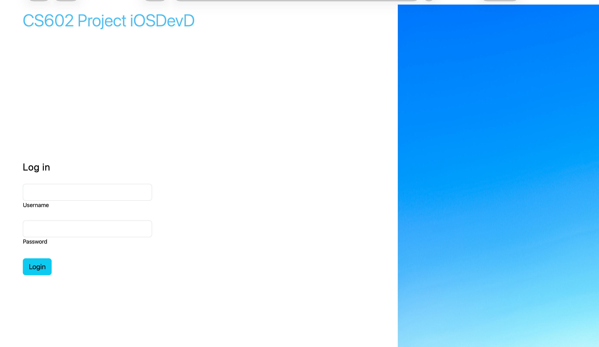
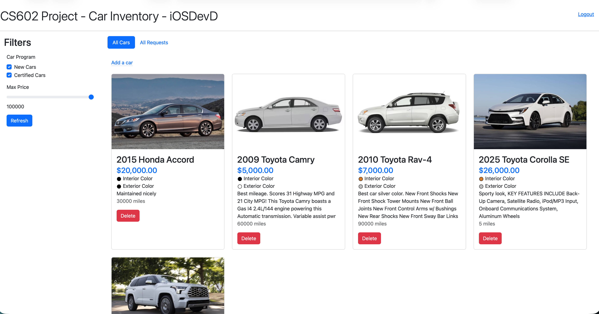

# CS602 Car-Inventory-Project
Car dealership platform: customers browse new/certified cars, filter by program or price, and submit request forms without login (viewable under "My Requests"). Staff/admin users log in to view all requests, see quote counts per car, mark requests as contacted, and add or delete car listings.

## Demo Images

Admin login page:

Admin dashboard after login:

## APIs

The project provides a set of APIs to be used by client-based applications. For example, if an iOS or Android app is developed, those platforms can use the same server endpoints, which helps avoid rewriting the server-side code.

These Express endpoints handle both HTML and JSON responses. Behind the scenes, the route handlers use GraphQL through Apollo Client, and the project runs an Apollo GraphQL server that exposes the query and mutation operations used by these endpoints.

| Path | Description | Method | Role needed |
| --- | --- | --- | --- |
| `/allCars` | Fetch all cars from the database that are not deleted. | GET | None needed |
| `/addCar` | Add a car to the database. | POST | admin |
| `/allRequests` | Fetch all requests submitted to the dealership. | GET | admin or staff |
| `/deleteFinal/:vinNumber` | Delete a car for the provided VIN number by marking it as deleted. | GET | admin |

GraphQL implementation details:

| Code location | GraphQL usage |
| --- | --- |
| `graphQL/server_graphQL_apollo.js` | Defines the Apollo GraphQL server, including `Query` operations such as `allCars` and `allCarQuoteRequests`, plus mutations such as `upsertCar` and `deleteCar`. |
| `routes/apolloClientInit.js` | Configures Apollo Client to call the GraphQL server at `http://localhost:4000`. |
| `carInventoryModule.js` | Fetches car data for `/allCars` using the `allCars` GraphQL query. |
| `routes/addCarRouter.js` | Adds cars using the `upsertCar` GraphQL mutation. |
| `routes/allRequestsRouter.js` | Fetches dealership requests using the `allCarQuoteRequests` GraphQL query. |
| `routes/deleteCarRouter.js` | Deletes cars using the `deleteCar` GraphQL mutation. |
